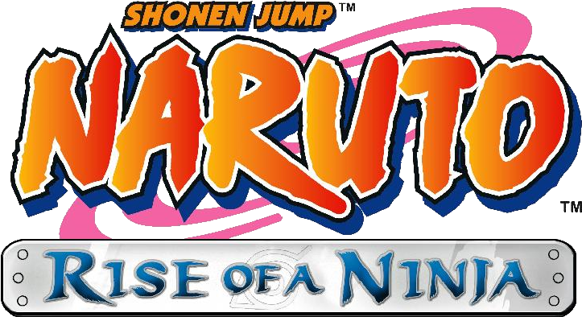

  

<h1 align="center">Naruto: Rise of a Ninja — Recomp</h1>

  A static recompilation for PC powered by ReXGlue 
  <strong>Ultrawide • DLC support • English and Brazilian Portuguese launcher</strong>

  <a href="docs/build-and-run.md">Build and run</a> ·
  <a href="docs/configuration.md">Configuration</a> ·
  <a href="docs/dlc.md">DLCs</a> ·
  <a href="docs/troubleshooting.md">Troubleshooting</a>

## About

A PC port of **Naruto: Rise of a Ninja**, originally released for Xbox 360. The project uses the [ReXGlue SDK](https://github.com/rexglue/rexglue-sdk) to translate the game's PowerPC code into C++ and compile it for native execution. The SDK runtime provides system services, graphics, audio, and input.

The current build and distribution workflow targets **Windows x64**. The project is under development; presets for other platforms exist, but do not represent complete or verified support for this port.

## Features

- **21:9 and 32:9 ultrawide**, with projection adjustments and anamorphic presentation; a 16:9 option is available in the launcher.
- **DLC support**, with launcher import and STFS package installation at game startup. Character DLCs use an additional recompiled engine module.
- **Native launcher**, built with SDL3 and Dear ImGui, available in English and Brazilian Portuguese.
- **1× to 4× resolution scaling**, up to 16× anisotropic filtering, fullscreen, and VSync.
- **Post-processing**, including FXAA and optional SDK FidelityFX integration.
- **FPS and frametime overlay**, toggled with `F1`, and an option to skip intro videos.
- **Bundled shader cache**, copied into the user cache when available.
- **Portable distribution and Windows installer**, with optional ISO import through the installer.

## Getting started

You need the files from your Xbox 360 copy of the game. The source tree does not include game data or DLC packages.

1. Use a Windows package built from the project or follow the [build guide](docs/build-and-run.md).
2. Import your ISO through the installer. For a portable installation, place extracted files in `game/` or select their folder in the launcher.
3. Open `narutorise_launcher.exe`, select your monitor's aspect ratio, and adjust graphics settings.
4. Launch the game. For additional content, see the [DLC guide](docs/dlc.md).

Runtime requirements: Windows x64, a Direct3D 12-compatible GPU for the default backend, and the [Microsoft Visual C++ x64 Redistributable](https://aka.ms/vs/17/release/vc_redist.x64.exe). The launcher uses Direct3D 11. An SDL-compatible controller is recommended; mouse and keyboard mode is disabled by default.

## Documentation

| Guide | Contents |
| --- | --- |
| [Build and run](docs/build-and-run.md) | Toolchain, SDK, code generation, compilation, and first launch |
| [Configuration](docs/configuration.md) | Ultrawide, graphics, shortcuts, and user files |
| [DLCs and Title Updates](docs/dlc.md) | Content installation and additional module build |
| [Architecture and analysis](docs/architecture.md) | Project structure, technical workflow, and areas to address |
| [Troubleshooting](docs/troubleshooting.md) | Build failures, runtime issues, and diagnostics |
| [Packaging](packaging/README.md) | Portable ZIP and Inno Setup installer |
| [Installer verification](docs/installer-status.md) | Existing tests and manual verification steps |

## Contributing

Read the [technical analysis](docs/architecture.md) before changing the runtime or code generation files. When reporting an issue, include reproduction steps, version/build, CPU, GPU, driver, configuration, and logs from `logs/` next to the executable. Also mention whether you use ultrawide, DLCs, or a Title Update.

Keep game files, content packages, and generated recompiled code out of commits. SDK changes should include reproducible patches in `patches/sdk/`.

## Credits

- [ReXGlue](https://github.com/rexglue/rexglue-sdk), recompilation SDK and runtime.
- [Xenia](https://github.com/xenia-project/xenia) and [XenonRecomp](https://github.com/hedge-dev/XenonRecomp), foundations and references for the Xbox 360 recompilation ecosystem.
- [SDL](https://github.com/libsdl-org/SDL), [Dear ImGui](https://github.com/ocornut/imgui), [extract-xiso](https://github.com/XboxDev/extract-xiso), and [Inno Setup](https://jrsoftware.org/isinfo.php).
- The Xenia Canary community and Hells Gate Recomp, references cited in the ultrawide implementation.
- Ubisoft Montreal, for the original game. [Logo source](docs/assets/README.md).

Dependency licenses are located in their respective directories. The repository does not yet declare a project license at its root.
